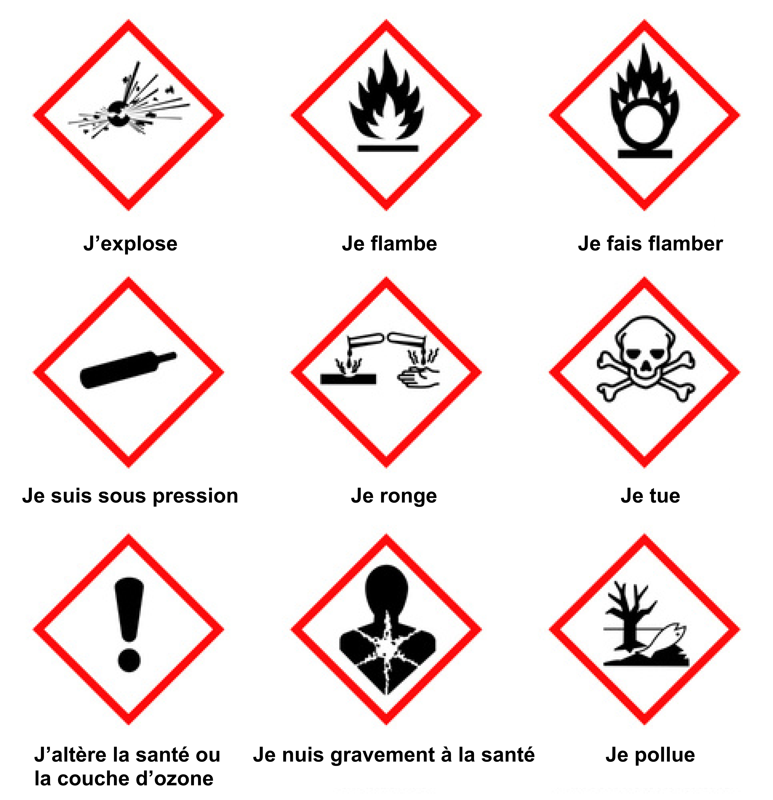

## La réglementation sur l’étiquetage des produits chimiques

La réglementation sur la classification, l’emballage et l’étiquetage des produits chimiques dangereux (dite réglementation CLP) vise à assurer la protection des travailleurs, des consommateurs et de l’environnement. Cette classification permet d’identifier les dangers que les produits peuvent présenter du fait de leurs propriétés physico-chimiques, de leurs effets sur la santé et sur l’environnement.

L’absence de classification ne signifie pas absence de dangers : un produit chimique est classé selon des critères définis réglementairement qui prennent en compte les degrés de gravité les plus élevés. De plus, un produit chimique peut ne pas être classé du fait de l’absence de données sur ses dangers.

Cette classification est affichée sur l’étiquette du produit, qui constitue la première information, essentielle et concise, fournie à l’utilisateur sur ces dangers et sur les précautions à prendre lors de l’utilisation. La taille de l’étiquette, tout comme la taille des symboles ou pictogrammes de danger, est réglementée. L’étiquette doit figurer sur le récipient d’origine et sur chacun des emballages successifs après transvasement et reconditionnement. Elle doit être suffisamment visible et rédigée en français.

## Les gestes à adopter en fonction du type de danger

Il existe 9 pictogrammes de danger répartis selon plusieurs classes de danger. 
 
1. Les dangers physiques 
    - explosif : peut exploser au contact d’une flamme, d’une étincelle, d’électricité statique, sous l’effet de la chaleur, ou de frottements. Manipuler et conserver à l’écart des sources de chaleur et autres causes d’étincelles ;
    - gaz sous pression : peut exploser sous l’effet de la chaleur et causer des brûlures ou blessures liées au froid (gaz liquéfiés réfrigérés). Protéger du soleil et éviter le contact avec la peau pour les liquides réfrigérés ;
    - inflammable : peut s’enflammer au contact d’une étincelle, d’électricité statique, sous l’effet de la chaleur, de frottements, au contact de l’air ou au contact de l’eau en dégageant des gaz inflammables. Manipuler et conserver à l’écart des sources de chaleur et autres causes d’étincelles ;
    - comburant : peut provoquer ou aggraver un incendie et provoquer une explosion en présence de produits inflammables. Manipuler et conserver à l’écart de la chaleur, des vêtements et autres matières combustibles ;
    - corrosif : peut ronger et attaquer ou détruire les métaux. Conserver le produit dans un récipient résistant à la corrosion.

2. Les dangers pour la santé
    - dangereux pour la santé : peut empoisonner à forte dose, irriter la peau, les yeux, les voies respiratoires, provoquer des allergies cutanées, ou encore provoquer somnolence ou vertige. Éviter tout contact avec le produit ;
    - toxique ou mortel : peut tuer rapidement et/ou empoisonne rapidement même à faible dose. Éviter tout contact (oral, cutané, par inhalation) avec le produit, porter un équipement de protection et laver soigneusement les zones exposées après usage ;
    - corrosif : peut provoquer des brûlures de la peau et des lésions aux yeux en cas de contact ou de projection. Éviter tout contact avec les yeux et la peau, ne pas inhaler ;
    - très dangereux pour la santé : peut provoquer le cancer, modifier l’ADN, nuire à la fertilité ou au fœtus, altérer le fonctionnement de certains organes, peut être mortel en cas d’ingestion et de pénétration dans les voies respiratoires, ou encore provoquer des difficultés respiratoires. Bien consulter les consignes d’utilisation. Éviter tout contact avec le produit, porter un équipement de protection et laver les zones exposées.

3. Les dangers pour l’environnement
    - dangereux pour l’environnement aquatique : pollue et provoque des effets néfastes (à court et/ou à long terme) sur les organismes du milieu aquatique ;
    - dangereux pour la couche d’ozone : détruit la couche d’ozone. Ne pas rejeter ces produits dans l’environnement.

## Reconnaître les pictogrammes de danger

